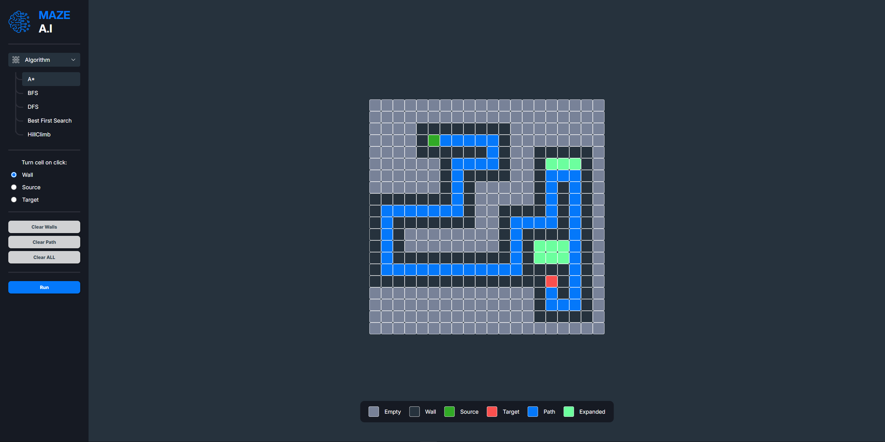

# Maze AI

<div align="center">
  <a href="https://www.linkedin.com/in/leonardo-altemari-008a8017b/">
    
  </a>

  <a href="https://github.com/leoaltemari/tokenEvents-API/blob/development/LICENSE">
    
  </a>
</div>

### 🚀 Description

<div style="margin-bottom: 16px;" align="center">
  
</div>

This is an web UI that creates an way to visualize some path finder algorithim trough a maze map, where the user can interacts to it, selectin the source point, the target point and place walls on this maze to see how each algorithm deals with it to find the correct path.

At the moment we have just five path finding algorithms implemented, they are:

- [A\*](https://en.wikipedia.org/wiki/A*_search_algorithm)
- [DFS](https://en.wikipedia.org/wiki/Depth-first_search)
- [BFS](https://en.wikipedia.org/wiki/Breadth-first_search)
- [Best First Search](https://en.wikipedia.org/wiki/Best-first_search)
- [Hill Climb](https://www.geeksforgeeks.org/introduction-hill-climbing-artificial-intelligence/)

---

## 📜 Table of Contents

- [Installation](#installation)
- [Usage](#usage)
- [Contributing](#contributing)
- [License](#license)
- [Contact](#contact)

---

## 🔥 Installation

1. Install Angular CLI globally if not already installed:
   ```bash
   npm install -g @angular/cli
   ```
2. Clone the repository:
   ```bash
   git clone https://github.com/leoaltemari/Maze-AI.git
   ```
3. Navigate to the project directory:
   ```bash
   cd Maze-AI
   ```
4. Install dependencies:
   ```bash
   npm install
   ```

---

## 🌐 Usage

1. Run the development server:
   ```bash
   ng serve
   ```
2. Open your browser and navigate to:
   ```
   http://localhost:4200
   ```

---

## 👥 Contributing

1. Fork the repository.
2. Create a feature branch:
   ```bash
   git checkout -b feat/feature-name
   ```
3. Commit your changes:
   ```bash
   git commit -m "Description of changes"
   ```
4. Push to the branch:
   ```bash
   git push origin feat/feature-name
   ```
5. Create a pull request.

---

## 🔐 License

[MIT License](LICENSE)

---

## 📱 Contact

For questions or support, contact:

- **Author Name**: Leonardo Altemari Nogueira
- **Email**: leo.altemari@gmail.com

---
